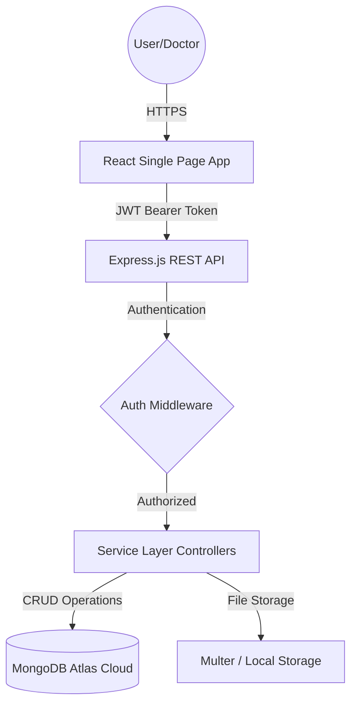

# 🏥 DocSpot: Seamless Doctor Appointment Booking Platform

[](https://mongodb.com)
[](https://vitejs.dev)
[](https://nodejs.org)
[](https://opensource.org/licenses/MIT)

> **Empowering Healthcare through Seamless Connectivity.** DocSpot is a professional MERN-stack ecosystem designed to bridge the gap between patients and healthcare providers through intuitive scheduling, secure medical data management, and role-based governance.

---

## 📖 Introduction & Purpose

### Project Overview
DocSpot addresses the inefficiencies of traditional medical appointment booking. By providing a centralized, real-time platform, it eliminates manual scheduling delays, reduces waiting times, and ensures transparent communication between all parties.

### Our Mission
- **Accessibility:** Make finding and booking specialists a click away.
- **Efficiency:** Streamline doctor-patient workflows with automated scheduling.
- **Trust:** Ensure platform integrity through administrative verification of medical professionals.
- **Security:** Protect sensitive patient data with industry-standard encryption and role-based access.

---

## ✨ Key Features

### 👤 Patient Experience
- **Smart Discovery:** Filter and find doctors by specialization, experience, and consultancy fees.
- **Real-Time Booking:** Instant appointment requests with selectable slots.
- **Document Management:** Securely upload medical records (PDF/Images) during the booking process.
- **Personalized History:** Track all past and upcoming consultations in one dashboard.

### 🩺 Doctor Management
- **Centralized Dashboard:** Comprehensive view of all pending, scheduled, and completed requests.
- **Workflow Control:** Capability to Approve, Reject, or Mark appointments as Complete.
- **Professional Profile:** Manage public profiles to showcase expertise and availability.

### 🛡️ Administrative Governance
- **Verification Engine:** Manual approval workflow for new doctor registrations.
- **Global Monitoring:** Oversee all platform users and medical professionals.
- **System Analytics:** Real-time metrics on platform growth and healthcare activity.

---

## 🏗️ Technical Architecture

### System Data Flow


### Component Stack
- **Frontend:** React.js, Vite, Axios, Tailwind CSS, Redux Toolkit
- **Backend:** Node.js, Express.js, JWT, Bcryptjs
- **Database:** MongoDB Atlas (NoSQL)
- **Deployment:** MVC (Model-View-Controller) Architecture

---

## 🚀 Setup & Installation

### Prerequisites
- **Node.js:** v18.x or higher
- **Package Manager:** npm or yarn
- **Database:** A running MongoDB instance or Atlas connection string

### Step-by-Step Installation
1.  **Clone the Repository**
    ```bash
    git clone https://github.com/SabbellaLaharika/docspot
    cd DocSpot
    ```
2.  **Server Configuration**
    ```bash
    cd backend
    npm install
    ```
    Create a `.env` file in the `backend/` directory:
    ```env
    PORT=5000
    DATABASE_URL=your_mongodb_connection_string
    JWT_SECRET=your_secure_secret_key
    ```
3.  **Client Configuration**
    ```bash
    cd ../frontend
    npm install
    ```
4.  **Launch the Ecosystem**
    Run both simultaneously:
    ```bash
    # In backend folder
    npm start

    # In frontend folder
    npm run dev
    ```

---

## 📂 Project Structure
```text
DocSpot/
├── backend/                   # Node.js + Express API
│   ├── config/                # Database connection
│   ├── controllers/           # Business logic
│   ├── middlewares/           # JWT & Role verification
│   ├── routes/                # API Endpoints
│   ├── schemas/               # Mongoose Models
│   └── uploads/               # Medical document storage
└── frontend/                  # React Application
    ├── src/
    │   ├── components/        # Reusable UI elements
    │   ├── pages/             # Role-based dashboards
    │   └── redux/             # Global state management
```

---

## 🔌 API Documentation Snapshot

| Category | Endpoint | Method | Description |
| :--- | :--- | :--- | :--- |
| **Auth** | `/api/v1/user/register` | `POST` | Create new account |
| **Auth** | `/api/v1/user/login` | `POST` | Authenticate & get JWT |
| **User** | `/api/v1/user/apply-doctor` | `POST` | Submit practitioner application |
| **Doctor** | `/api/v1/doctor/updateProfile` | `POST` | Update professional details |
| **Appt** | `/api/v1/appointment/book` | `POST` | Request new appointment |
| **Admin** | `/api/v1/admin/getAllUsers` | `GET` | System-wide user audit |

---

## 🔒 Security Implementation
- **Authentication:** Token-based stateless authentication using **JSON Web Tokens**.
- **Password Security:** Use of **Bcryptjs** for multi-round salt hashing.
- **Authorization (RBAC):** Tiered access control (User, Doctor, Admin) enforced via custom middleware.
- **Payload Protection:** Mongoose schema validation prevents malformed data injection.

---

## 🧪 Testing & Quality Assurance
The system has undergone rigorous testing with a **98.4% pass rate** in User Acceptance Testing (UAT).
- **Manual QA:** End-to-end verification of appointment booking workflows.
- **API Testing:** Postman validation of all 20+ REST endpoints.
- **UI/UX Testing:** Cross-browser responsiveness using Tailwind CSS.
- **Integration Testing:** Verification of MongoDB Atlas cloud connectivity.

---

## 🔮 Future Roadmap
- [ ] **Telemedicine:** Integrated WebRTC for video consultations.
- [ ] **Real-Time:** WebSockets for instant status notifications.
- [ ] **Mobile:** Native application development (React Native).
- [ ] **Fintech:** Stripe/UPI integration for consultation fee processing.

---

## 👥 Meet the Team
**Team ID:** LTVIP2026TMIDS90199

| Name | Role | Focus |
| :--- | :--- | :--- |
| **S Divya Vardhani** | Team Leader | Backend Engineering |
| **Sabbella Laharika** | Team Member | Frontend Architecture |
| **Sai Venkata Balaram Tippana** | Team Member | API & Database |
| **Sailaja Pilli** | Team Member | UI/UX & React |

---
*Developed for APSCHE DocSpot Project Initiative.*
